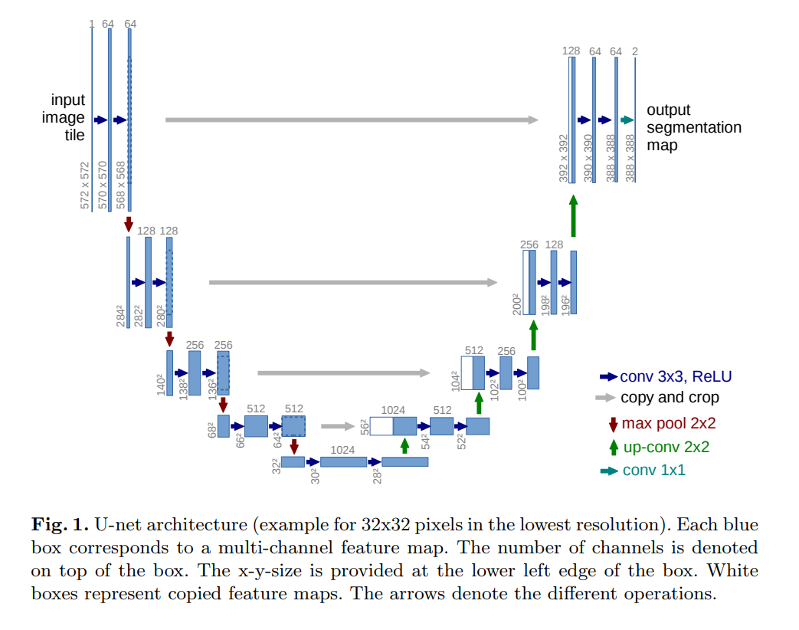

## CNN Architectures

### U-Net

首先来一个典型U-Net，Caffe的prototxt：https://raw.githubusercontent.com/jolibrain/deepdetect/master/templates/caffe/unet/unet.prototxt。

上图来自U-Net论文。https://arxiv.org/pdf/1505.04597.pdf

U-Net是一种对称结构，好像是个哑铃。网络先讲feature map变小、channel数增加。然后再对称地还原尺寸，并concat。下采样采用max-pooling，上采样采用deconv。两端对应尺寸的feature map，采用concat拼接（会导致channel加倍）。

#### 适用问题

原始论文用于解决Image Segmentation的问题：U-Net: Convolutional Networks for Biomedical Image Segmentation。

### Densenet